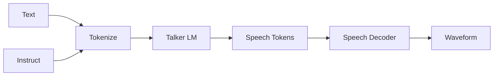

# Qwen3-TTS-12Hz-1.7B-VoiceDesign to Core ML Conversion Guide

This document describes how to convert [Qwen/Qwen3-TTS-12Hz-1.7B-VoiceDesign](https://huggingface.co/Qwen/Qwen3-TTS-12Hz-1.7B-VoiceDesign) to Core ML format for use on iOS. The model uses a discrete multi-codebook LM architecture (different from VibeVoice's LLM+Diffusion+VAE).

## Overview

- **Source model**: [Qwen/Qwen3-TTS-12Hz-1.7B-VoiceDesign](https://huggingface.co/Qwen/Qwen3-TTS-12Hz-1.7B-VoiceDesign) (~4.5GB Safetensors)
- **Architecture**: Discrete multi-codebook LM - Text + Instruct -> LM (Talker) -> discrete tokens -> SpeechTokenizer decode -> waveform
- **Conversion path**: PyTorch (per component) -> coremltools `ct.convert()` -> .mlpackage
- **Variants**: 4bit, 5bit, 6bit, 8bit, fp16 (from single source via quantization)

## Pipeline (conceptual)



## Prerequisites

- macOS or Linux (coremltools does not support Windows natively; see [CoreML-Conversion-Windows.md](../CoreML-Conversion-Windows.md) for WSL/Docker options)
- Python 3.9+ with venv or Conda
- Dependencies: `pip install qwen-tts torch coremltools huggingface_hub soundfile`

## Model download

```bash
huggingface-cli download Qwen/Qwen3-TTS-12Hz-1.7B-VoiceDesign --local-dir ./models/Qwen3-TTS-12Hz-1.7B-VoiceDesign
```

## Convert to Core ML (multiple variants)

```bash
python Scripts/convert_qwen3_tts_voicedesign_to_coreml.py \
  --model-dir ./models/Qwen3-TTS-12Hz-1.7B-VoiceDesign \
  --output-dir ./models/qwen3-tts-voicedesign/coreml \
  --variants 4bit 5bit 6bit 8bit fp16
```

**Tokenizer only** (low memory, use when RAM is limited):

```bash
python Scripts/convert_qwen3_tts_voicedesign_to_coreml.py \
  --model-dir ./models/Qwen3-TTS-12Hz-1.7B-VoiceDesign \
  --output-dir ./models/qwen3-tts-voicedesign/coreml \
  --variants 4bit 5bit 6bit 8bit fp16 \
  --skip-speech-decoder
```

Output structure:

```
models/qwen3-tts-voicedesign/coreml/
  4bit/
    tokenizer/ (config.json, vocab.json, merges.txt, tokenizer_config.json, etc.)
    qwen3_tts_speech_decoder.mlpackage  (when full conversion succeeds)
  5bit/
    tokenizer/ (same)
  6bit/
    tokenizer/ (same)
  8bit/
    tokenizer/ (same)
  fp16/
    tokenizer/ (same)
```

## Conversion results (as of implementation)

The conversion script successfully:
- Loads the model via qwen-tts
- Copies tokenizer files (config.json, vocab.json, merges.txt, etc.) to all 5 variant directories (4bit, 5bit, 6bit, 8bit, fp16)
- Applies a monkey-patch to `create_causal_mask` and `create_sliding_window_causal_mask` in qwen_tts to use a simple tril mask during JIT trace (avoids transformers packed_sequence_mask/vmap failure)

Known limitations:
- **Talker (LM)**: Uses autoregressive `model.generate()`; requires single-step forward extraction and Swift loop implementation
- **Speech Decoder**: With the mask patch, JIT trace progresses but the conversion may run out of memory (OOM kill, exit 137) on machines with limited RAM. The speech decoder is a large model (~100M+ parameters). Recommended: 32GB+ RAM for conversion.
- **Output**: When successful, `qwen3_tts_speech_decoder.mlpackage` is produced in each variant directory. Tokenizer files are always copied.

## Known limitations

- **Architecture complexity**: Qwen3-TTS uses autoregressive generation; the conversion may require unrolling or stateful models
- **Speech Decoder**: Contains dynamic control flow (tensor iteration, shape-dependent logic) that coremltools cannot convert
- **Model size**: 1.7B parameters; quantization (4bit) recommended for mobile

## iOS app integration

The app typically searches for CoreML models in this order:
1. **Documents**: `Documents/Models/qwen3-tts-voicedesign/coreml/{variant}/`
2. **Project** (simulator/dev): `{project}/models/qwen3-tts-voicedesign/coreml/{variant}/`

Copy the converted output (tokenizer + .mlpackage) to the appropriate directory for your app.

## File reference

| File | Purpose |
|------|---------|
| `Scripts/convert_qwen3_tts_voicedesign_to_coreml.py` | Convert to Core ML with multiple variants |
| [CoreML-Conversion-Windows.md](../CoreML-Conversion-Windows.md) | Running conversion on Windows (WSL, Docker, remote) |
